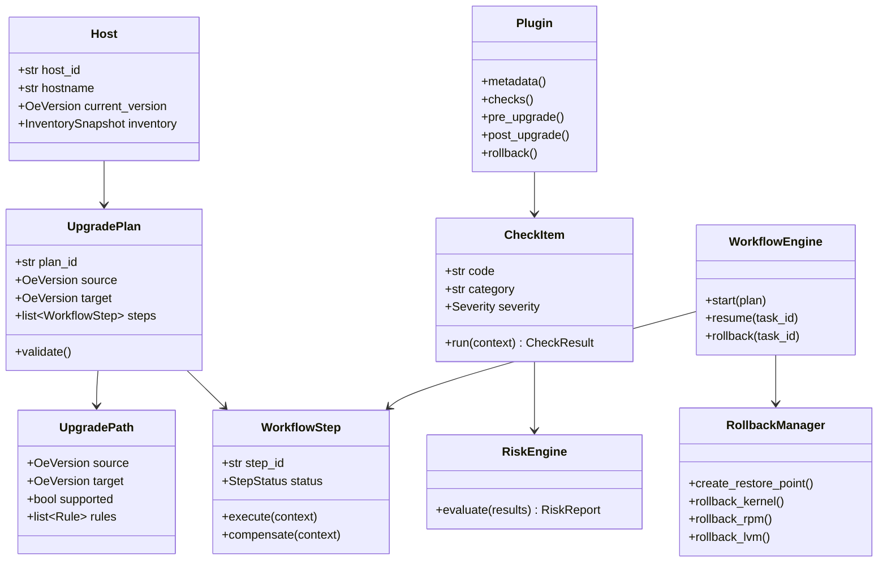
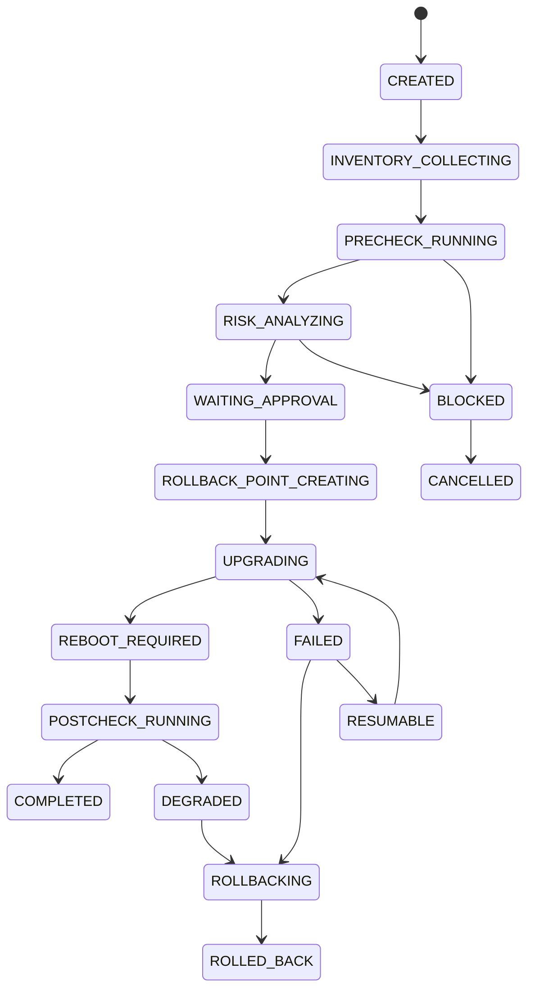

# oe-lifecycle-manager 总体架构设计

## 1. 总体架构设计

`oe-lifecycle-manager` 定位为企业级 openEuler 生命周期管理平台，核心目标是提供完全离线、可审计、可回滚、可断点续升的操作系统原地升级能力。平台参考 Leapp、x2openEuler 和企业生命周期管理系统的设计思想，但面向 openEuler 长期演进独立建模。

系统采用 Clean Architecture + Hexagonal Architecture 分层：

- 接入层：CLI、REST API、Web Console、Agent RPC。
- 应用层：升级编排、预检查、风险评估、回滚编排、报告生成、任务恢复。
- 领域层：主机、升级路径、检查项、风险、工作流、回滚点、插件、兼容性规则。
- 基础设施层：SQLite、YAML 配置、本地 ISO/Repo、RPM/DNF、LVM、systemd、内核、HTML 报告渲染。
- 插件层：Kubernetes、Docker、Containerd、MySQL、MariaDB、DM、GaussDB、Redis、RabbitMQ、OpenStack、MCloud、iStack。

关键约束：

- 所有升级包、规则库、兼容性库、知识库必须来自本地介质或本地仓库。
- 禁止在升级流程中依赖互联网。
- 所有高风险动作必须有审计记录、状态持久化和恢复入口。
- 支持未来 5 到 10 年通过插件、规则、兼容性数据库扩展新版本和新业务组件。

## 2. 模块设计

| 模块 | 职责 |
| --- | --- |
| `lifecycle` | openEuler 版本、升级路径、生命周期策略建模。 |
| `inventory` | 采集主机硬件、内核、RPM、驱动、服务、存储、容器、中间件信息。 |
| `repo` | 挂载本地 ISO，管理本地 Repo，校验离线包完整性。 |
| `precheck` | 执行升级前检查项，生成 `precheck.html`。 |
| `risk` | 汇总检查结果，输出 LOW、MEDIUM、HIGH、CRITICAL 风险等级。 |
| `compatibility` | 查询版本、RPM、驱动、内核 ABI、服务兼容性数据库。 |
| `workflow` | 管理升级工作流、步骤依赖、断点续升、失败恢复。 |
| `upgrade` | 执行升级准备、包替换、配置迁移、内核切换、重启标记。 |
| `rollback` | 管理 LVM Snapshot、Kernel Rollback、RPM Rollback。 |
| `reporting` | 生成 `risk_report.html`、`upgrade_report.html`、`postcheck.html`。 |
| `plugin` | 插件发现、生命周期钩子、插件检查项、插件风险规则。 |
| `audit` | 操作日志、任务日志、报告归档、审计查询。 |
| `api` | REST API、CLI 命令、外部系统集成接口。 |

## 3. 类图



## 4. 数据库设计

SQLite 作为本地控制平面数据库，所有任务状态和审计数据必须持久化。

| 表 | 关键字段 | 说明 |
| --- | --- | --- |
| `hosts` | `id`, `hostname`, `arch`, `current_version`, `kernel`, `created_at` | 主机基础信息。 |
| `inventory_snapshots` | `id`, `host_id`, `snapshot_json`, `created_at` | 升级前后资产快照。 |
| `upgrade_paths` | `id`, `source_version`, `target_version`, `supported`, `metadata_json` | 支持的升级路径。 |
| `upgrade_tasks` | `id`, `host_id`, `source_version`, `target_version`, `status`, `checkpoint`, `created_at`, `updated_at` | 升级任务。 |
| `workflow_steps` | `id`, `task_id`, `name`, `status`, `order_no`, `started_at`, `finished_at`, `error` | 工作流步骤状态。 |
| `check_items` | `id`, `code`, `category`, `severity`, `enabled`, `plugin_name` | 检查项定义。 |
| `check_results` | `id`, `task_id`, `check_code`, `status`, `risk_level`, `message`, `detail_json` | 检查结果。 |
| `risk_reports` | `id`, `task_id`, `risk_level`, `score`, `summary_json`, `html_path` | 风险报告。 |
| `rollback_points` | `id`, `task_id`, `type`, `status`, `payload_json`, `created_at` | LVM、Kernel、RPM 回滚点。 |
| `plugins` | `id`, `name`, `version`, `enabled`, `metadata_json` | 插件注册表。 |
| `audit_logs` | `id`, `task_id`, `actor`, `action`, `target`, `result`, `created_at` | 审计日志。 |
| `compatibility_records` | `id`, `kind`, `source`, `target`, `component`, `result`, `rule_json` | 兼容性数据库。 |
| `knowledge_articles` | `id`, `code`, `title`, `content`, `tags`, `updated_at` | 知识库。 |

## 5. 状态机设计

升级任务状态：



断点续升原则：

- 每个工作流步骤开始和结束都写入 `workflow_steps`。
- 每个破坏性步骤必须先登记可恢复点。
- 系统重启后由 `checkpoint` 定位最后一个可恢复步骤。
- 幂等步骤可重新执行，非幂等步骤必须提供 `compensate()`。

## 6. 插件机制设计

插件采用 Python 包 + YAML manifest：

```yaml
name: mysql
version: 1.0.0
entrypoint: oe_lifecycle_plugins.mysql:Plugin
supported_versions:
  - 22.03
  - 22.03-SP1
  - 22.03-SP2
  - 22.03-SP3
  - 22.03-SP4
  - 24.03
  - 26.03
hooks:
  - inventory
  - precheck
  - risk
  - pre_upgrade
  - post_upgrade
  - rollback
```

插件接口：

- `metadata()`：返回名称、版本、支持范围。
- `inventory(context)`：采集业务组件状态。
- `checks(context)`：返回插件检查项。
- `risk_rules(context)`：返回风险规则。
- `pre_upgrade(context)`：升级前业务保护。
- `post_upgrade(context)`：升级后验证。
- `rollback(context)`：业务组件回滚。

插件隔离策略：

- 插件异常不能导致核心引擎崩溃。
- 插件输出必须结构化并写入审计。
- 插件必须声明支持的 openEuler 版本和组件版本。
- 插件检查项纳入统一风险模型。

## 7. 目录结构设计

```text
oe-lifecycle-manager/
  README.md
  pyproject.toml
  configs/
    lifecycle.yaml
    upgrade_paths.yaml
    risk_rules.yaml
  docs/
    architecture-design.md
  src/
    oe_lifecycle_manager/
      __init__.py
      main.py
      domain/
        lifecycle.py
        host.py
        upgrade.py
        risk.py
        rollback.py
        plugin.py
      application/
        inventory_service.py
        precheck_service.py
        risk_service.py
        workflow_service.py
        upgrade_service.py
        rollback_service.py
        report_service.py
      infrastructure/
        database/
        repo/
        rpm/
        lvm/
        systemd/
        report/
      adapters/
        cli/
        rest/
        agent/
      plugins/
        kubernetes/
        docker/
        containerd/
        mysql/
        mariadb/
        dm/
        gaussdb/
        redis/
        rabbitmq/
        openstack/
        mcloud/
        istack/
  tests/
    unit/
    integration/
    fixtures/
  reports/
  data/
    lifecycle.db
    compatibility.db
    knowledge.db
```

## 8. API 设计

REST API：

| 方法 | 路径 | 说明 |
| --- | --- | --- |
| `GET` | `/api/v1/versions` | 查询支持的 openEuler 版本。 |
| `GET` | `/api/v1/upgrade-paths` | 查询支持的升级路径。 |
| `POST` | `/api/v1/hosts` | 注册主机。 |
| `GET` | `/api/v1/hosts/{host_id}` | 查询主机详情。 |
| `POST` | `/api/v1/tasks` | 创建升级任务。 |
| `POST` | `/api/v1/tasks/{task_id}/precheck` | 执行预检查。 |
| `POST` | `/api/v1/tasks/{task_id}/risk` | 执行风险分析。 |
| `POST` | `/api/v1/tasks/{task_id}/approve` | 审批升级。 |
| `POST` | `/api/v1/tasks/{task_id}/start` | 开始升级。 |
| `POST` | `/api/v1/tasks/{task_id}/resume` | 断点续升。 |
| `POST` | `/api/v1/tasks/{task_id}/rollback` | 执行回滚。 |
| `GET` | `/api/v1/tasks/{task_id}/reports/{type}` | 下载 HTML 报告。 |
| `GET` | `/api/v1/plugins` | 查询插件。 |
| `PATCH` | `/api/v1/plugins/{name}` | 启用或禁用插件。 |

CLI：

```text
oe-lifecycle inventory collect
oe-lifecycle path list
oe-lifecycle task create --target 24.03 --repo /mnt/repo
oe-lifecycle precheck run --task <id>
oe-lifecycle risk report --task <id>
oe-lifecycle upgrade start --task <id>
oe-lifecycle upgrade resume --task <id>
oe-lifecycle rollback start --task <id> --type lvm|kernel|rpm
oe-lifecycle report open --task <id> --type precheck|risk|upgrade|postcheck
```

## 9. 风险模型设计

风险类别：

- 软件风险：RPM 冲突、包缺失、第三方包、签名异常、脚本失败。
- 驱动风险：闭源驱动、弱兼容驱动、DKMS、存储和网卡驱动。
- 内核风险：内核 ABI、启动项、内核参数、模块加载。
- 业务风险：数据库、容器、虚拟化、消息队列、云平台组件。
- 存储风险：LVM、磁盘空间、文件系统、挂载点、快照容量。
- 回滚风险：无快照、回滚点不完整、RPM 缓存不足、内核回退不可用。

等级规则：

| 等级 | 分数范围 | 处理策略 |
| --- | --- | --- |
| LOW | `0-24` | 可直接升级，记录提示。 |
| MEDIUM | `25-49` | 允许升级，但需要展示人工确认。 |
| HIGH | `50-79` | 默认阻断，需要显式审批和处置建议。 |
| CRITICAL | `80-100` | 阻断升级，除非规则被管理员强制豁免。 |

评分模型：

```text
final_score =
  software_score * 0.20 +
  driver_score * 0.20 +
  kernel_score * 0.20 +
  business_score * 0.20 +
  storage_score * 0.10 +
  rollback_score * 0.10
```

硬性升级阻断：

- 当前版本和目标版本不在支持路径中。
- 本地 Repo 或 ISO 校验失败。
- 根分区空间不足且无法创建回滚点。
- 发现 CRITICAL 级内核、存储或启动风险。
- 业务插件声明当前组件不支持目标版本。

企业级检查体系至少 100 项，按以下分类组织：

| 分类 | 数量 |
| --- | ---: |
| 版本与升级路径 | 8 |
| 本地 Repo 与包完整性 | 12 |
| RPM 与依赖 | 14 |
| 内核与启动 | 12 |
| 驱动与硬件 | 10 |
| 存储与文件系统 | 12 |
| 网络与安全策略 | 8 |
| systemd 与关键服务 | 8 |
| 容器与 Kubernetes | 8 |
| 数据库与中间件 | 8 |
| 回滚能力 | 10 |
| 审计与报告 | 4 |

## 10. 测试体系设计

测试分层：

- 单元测试：领域模型、风险评分、规则匹配、状态机转换、插件接口。
- 集成测试：SQLite、Repo 扫描、RPM 查询、LVM 回滚点、HTML 报告生成。
- 工作流测试：预检查、风险评估、审批、升级、断点恢复、回滚。
- 插件测试：每个插件提供 fixtures，验证检查项、风险规则和钩子行为。
- 离线测试：模拟无网络环境，确认不访问互联网。
- 兼容性测试：覆盖 22.03-SP1 -> SP2、SP2 -> SP3、SP3 -> SP4、22.03 -> 24.03、24.03 -> 26.03。
- 故障注入测试：断电、进程中断、Repo 损坏、RPM 失败、快照失败、重启恢复。
- 安全测试：权限边界、命令注入、路径穿越、审计完整性。

CI/CD 设计：

- `ruff` 或同类工具做静态检查。
- `mypy` 或同类工具做类型检查。
- `pytest` 执行单元和集成测试。
- 每次合并生成测试覆盖率报告。
- 使用离线 fixtures 模拟 ISO、Repo、RPM 数据库和插件环境。

第一阶段交付边界：

- 本文档是架构设计基线。
- 下一阶段在确认后开始搭建项目骨架、领域模型、数据库 schema、插件框架和最小 CLI。
