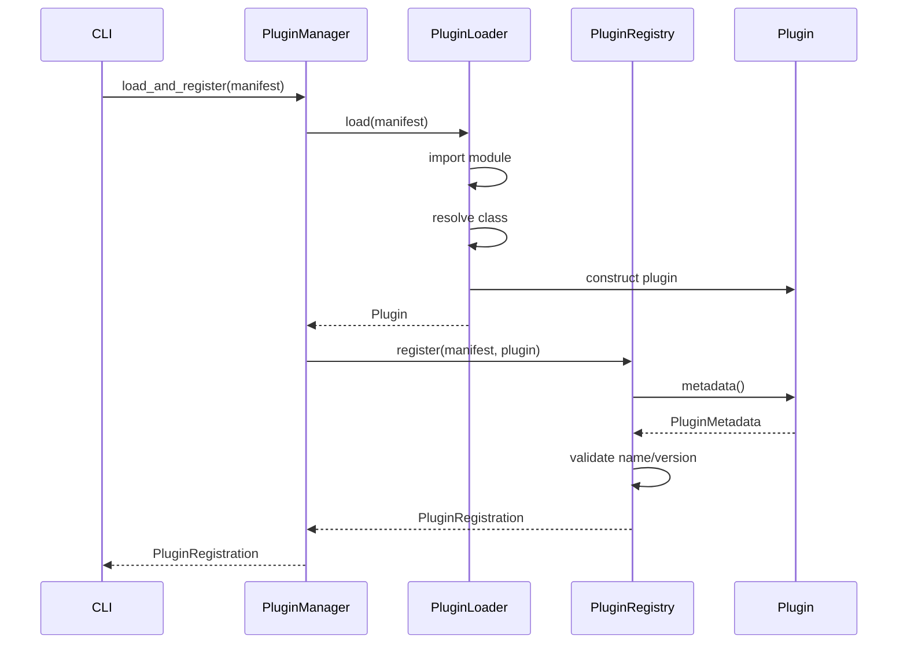
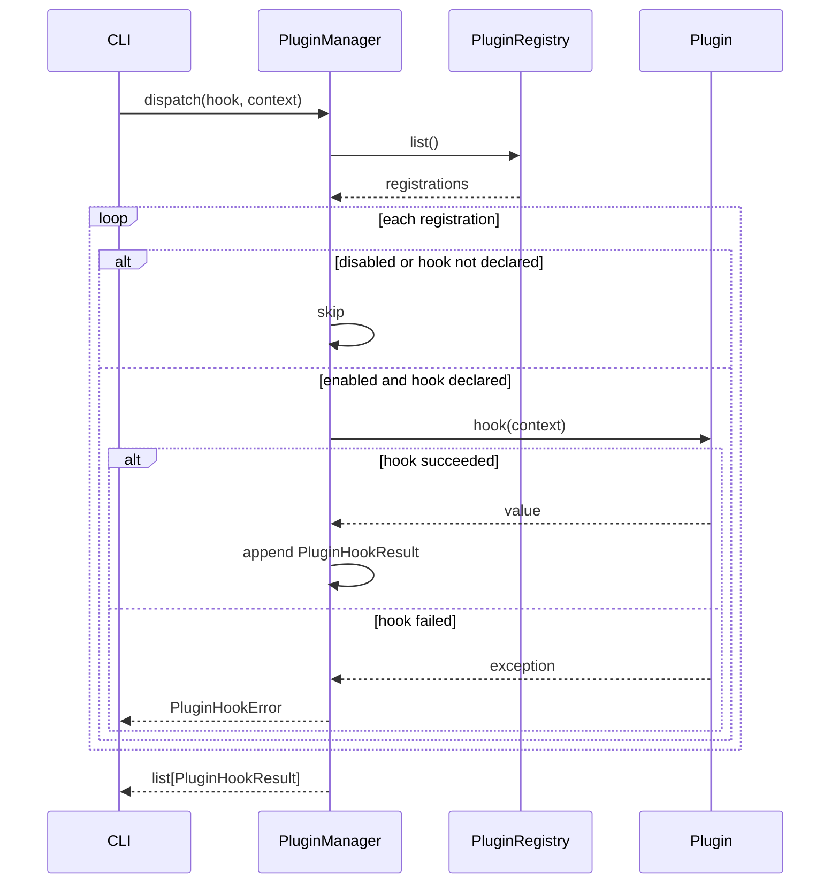

# Plugin Framework 设计说明

## 目标

Plugin Framework 为 Agentless CLI 版本提供可扩展的业务组件接入机制。核心目标是让 Kubernetes、Docker、Containerd、MySQL、MariaDB、DM、GaussDB、Redis、RabbitMQ、OpenStack、MCloud、iStack 等组件以插件形式接入生命周期管理流程。

当前实现只提供插件框架，不实现具体业务插件逻辑。

## 模块边界

已实现职责：

- 定义插件 manifest。
- 动态加载 `module:Class` 形式的插件入口。
- 注册插件并校验 manifest 与插件 metadata。
- 启用或禁用插件。
- 查询插件。
- 按生命周期 hook 调度插件。
- 统一封装插件加载和 hook 执行异常。

暂不实现职责：

- 不解析 YAML 文件，当前使用 `PluginManifest.from_dict()` 或直接构造 dataclass。
- 不实现具体组件检查项。
- 不实现插件依赖关系和版本约束求解。
- 不实现插件沙箱隔离。
- 不实现插件分发、安装或签名校验。
- 不将插件自动绑定到 Actor Framework，后续可扩展为 Actor 化插件执行。

## 核心类

| 类 | 说明 |
| --- | --- |
| `Plugin` | 插件领域基类，定义 metadata 和生命周期默认钩子。 |
| `PluginMetadata` | 插件声明的名称、版本、支持版本和 hook。 |
| `PluginManifest` | 框架侧 manifest，包含 entrypoint 和声明 hook。 |
| `PluginLoader` | 使用 `importlib` 从 manifest 动态加载插件。 |
| `PluginRegistry` | 插件注册表。 |
| `PluginManager` | 插件加载、注册、启停和 hook 调度入口。 |
| `PluginHook` | 支持的插件生命周期 hook 枚举。 |
| `PluginRegistration` | 插件实例、manifest 和启停状态。 |
| `PluginHookResult` | hook 执行结果。 |

## Hook 模型

支持的 hook：

- `inventory`
- `checks`
- `risk`
- `pre_upgrade`
- `post_upgrade`
- `rollback`

插件可以只声明自己支持的 hook。`PluginManager.dispatch()` 只会调用启用状态下、且 manifest 声明了该 hook 的插件。

## Manifest 模型

```python
manifest = PluginManifest(
    name="mysql",
    version="1.0.0",
    entrypoint="oe_lifecycle_manager.plugins.mysql.plugin:MysqlPlugin",
    supported_versions=("22.03-SP1", "22.03-SP2"),
    hooks=(PluginHook.INVENTORY, PluginHook.PRE_UPGRADE),
)
```

字典形式：

```python
manifest = PluginManifest.from_dict(
    {
        "name": "mysql",
        "version": "1.0.0",
        "entrypoint": "oe_lifecycle_manager.plugins.mysql.plugin:MysqlPlugin",
        "supported_versions": ["22.03-SP1", "22.03-SP2"],
        "hooks": ["inventory", "pre_upgrade"],
    }
)
```

## 加载与注册时序



## Hook 调度时序



## 与其他框架的关系

- Workflow Engine：在工作流步骤中调用 `PluginManager.dispatch()`，例如 `inventory`、`pre_upgrade`、`post_upgrade`。
- State Manager：插件 hook 结果可以由上层服务写入任务快照或审计事件。
- Actor Framework：后续可以把每个插件 hook 包装成 Actor 消息，以便隔离执行边界和增加调度策略。

## 验证范围

单元测试覆盖：

- manifest 字典解析。
- manifest 必填字段和 entrypoint 格式校验。
- 插件注册和 metadata 校验。
- 重复注册拒绝。
- 动态加载并注册插件。
- 非插件 entrypoint 拒绝。
- 启用和禁用插件。
- 按声明 hook 调度插件。
- 跳过未声明 hook。
- 调度指定插件。
- 缺失插件错误。
- hook 异常封装为 `PluginHookError`。
