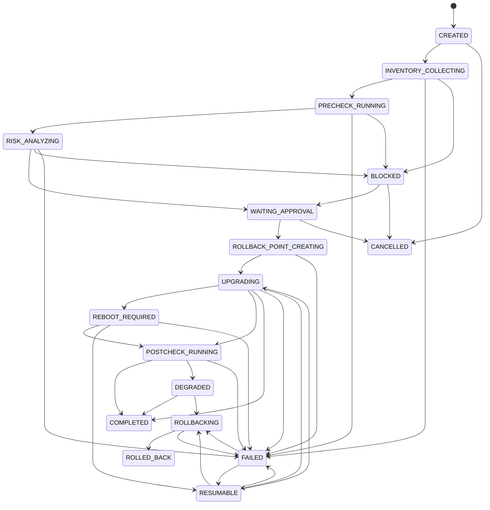
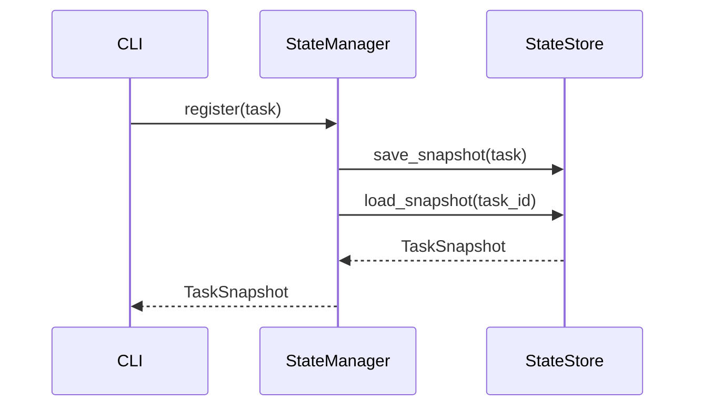
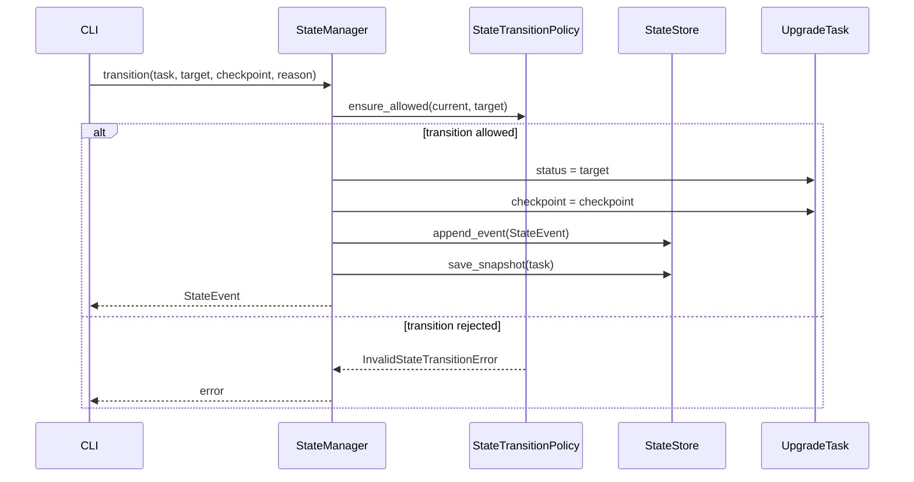
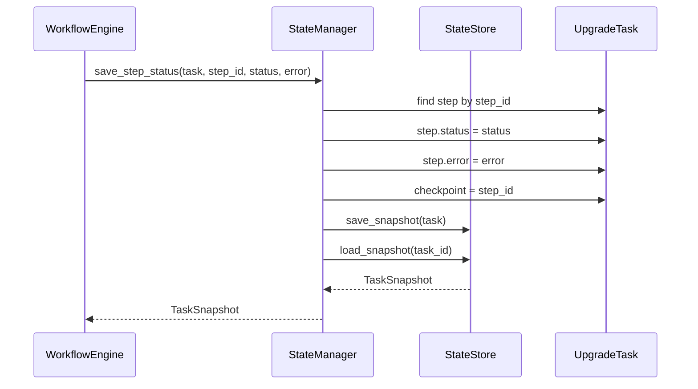

# State Manager 设计说明

## 目标

State Manager 是 Agentless CLI 版本的状态治理核心，负责统一管理升级任务状态、checkpoint、步骤状态快照和状态事件历史。它为断点续升和后续 SQLite 持久化提供稳定接口。

## 模块边界

已实现职责：

- 保存任务初始快照。
- 校验任务状态转移是否合法。
- 执行状态转移并记录事件。
- 保存任务 checkpoint。
- 保存单个工作流步骤状态。
- 提供内存存储实现用于 CLI 快速验证和单元测试。

暂不实现职责：

- 不实现 SQLite 持久化，后续由基础设施层实现 `StateStore`。
- 不直接驱动 Workflow Engine，当前由上层服务或 CLI 组合两者。
- 不实现业务审批、风险策略、重试策略。
- 不处理多进程锁和并发事务，后续持久化实现时补充。

## 核心类

| 类 | 说明 |
| --- | --- |
| `StateManager` | 状态管理入口，负责注册、转移、checkpoint 和步骤状态保存。 |
| `StateTransitionPolicy` | 任务状态转移策略。 |
| `StateStore` | 状态持久化端口。 |
| `InMemoryStateStore` | 内存状态存储实现。 |
| `TaskSnapshot` | 当前任务状态快照。 |
| `StateEvent` | 不可变状态转移事件。 |
| `InvalidStateTransitionError` | 非法状态转移错误。 |
| `TaskNotFoundError` | 快照不存在错误。 |

## 快照模型

`TaskSnapshot` 保存任务恢复所需的最小状态：

- `task_id`
- `status`
- `checkpoint`
- `step_statuses`

后续 SQLite 实现可以在此基础上增加版本号、更新时间、主机 ID、乐观锁字段等。

## 事件模型

`StateEvent` 记录每次状态转移：

- `task_id`
- `from_status`
- `to_status`
- `checkpoint`
- `reason`
- `created_at`

事件用于审计、排障和报告生成。当前只记录任务状态转移；步骤状态变化暂时进入快照，后续可扩展为步骤事件。

## 状态转移策略

终态：

- `COMPLETED`
- `ROLLED_BACK`
- `CANCELLED`

终态不允许继续转移。

## 注册任务时序

## 状态转移时序

## 步骤状态保存时序

## 与 Workflow Engine 的组合方式

当前两个模块保持解耦：

- Workflow Engine 负责执行步骤。
- State Manager 负责状态校验和快照。
- CLI 或后续应用服务负责在步骤开始、成功、失败时调用 State Manager。

后续可以在 Workflow Engine 增加可选 observer，在不破坏核心执行器的情况下把步骤状态变化自动写入 State Manager。

## 验证范围

单元测试覆盖：

- 注册任务并保存初始快照。
- 合法状态转移会保存事件和快照。
- 非法状态转移会被拒绝。
- 终态不可继续转移。
- 保存 checkpoint 不改变任务状态。
- 保存步骤状态会更新 checkpoint 和快照。
- 读取不存在快照会抛出 `TaskNotFoundError`。
