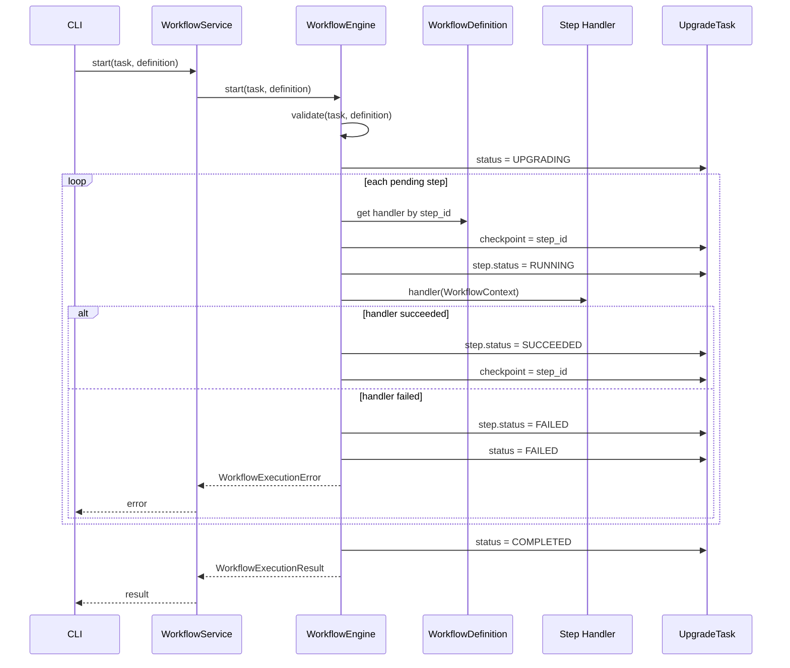
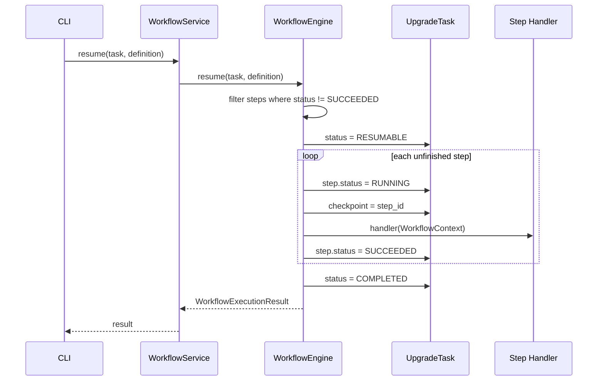

# Workflow Engine 设计说明

## 目标

Workflow Engine 是 Agentless CLI 版本的第一层核心框架，负责把一个升级任务拆成有序步骤并按顺序执行。它只处理通用编排能力，不包含 openEuler 升级业务逻辑。

## 模块边界

已实现职责：

- 校验工作流定义。
- 按 `UpgradePlan.steps` 顺序执行步骤。
- 将步骤状态更新为 `RUNNING`、`SUCCEEDED`、`FAILED`。
- 维护任务 `checkpoint`。
- 步骤失败时记录错误并抛出 `WorkflowExecutionError`。
- 支持从未完成步骤继续 `resume`。

暂不实现职责：

- 不做数据库持久化，后续由 State Manager 负责。
- 不做状态转移策略集中治理，后续由 State Manager 负责。
- 不做并发调度、消息投递或重试策略，后续由 Actor Framework 负责。
- 不加载插件，后续由 Plugin Framework 负责。
- 不实现真实升级、检查、回滚业务动作。

## 核心类

| 类 | 说明 |
| --- | --- |
| `WorkflowEngine` | 工作流执行器，提供 `start()` 和 `resume()`。 |
| `WorkflowDefinition` | 步骤处理器集合，按 `step_id` 绑定 handler。 |
| `WorkflowContext` | 传递给步骤 handler 的运行上下文。 |
| `WorkflowExecutionResult` | 工作流执行结果。 |
| `WorkflowDefinitionError` | 工作流定义错误。 |
| `WorkflowExecutionError` | 步骤执行失败错误。 |
| `WorkflowService` | 应用层服务，委托 `WorkflowEngine` 执行。 |

## 执行模型

每个步骤由调用方注入 handler：

```python
definition = WorkflowDefinition.from_handlers(
    {
        "collect": collect_handler,
        "precheck": precheck_handler,
        "upgrade": upgrade_handler,
    }
)

result = WorkflowEngine().start(task, definition)
```

handler 接收 `WorkflowContext`，其中包含：

- `task`：当前升级任务。
- `step`：当前执行步骤。
- `data`：本次执行共享的临时上下文。

## 时序图



## Resume 时序



## 验证范围

单元测试覆盖：

- 正常顺序执行并完成任务。
- 步骤失败时记录失败状态、错误信息和 checkpoint。
- `resume()` 跳过已成功步骤并重试失败步骤。
- 缺少 handler 时拒绝执行。
- 重复 step id 时拒绝执行。
